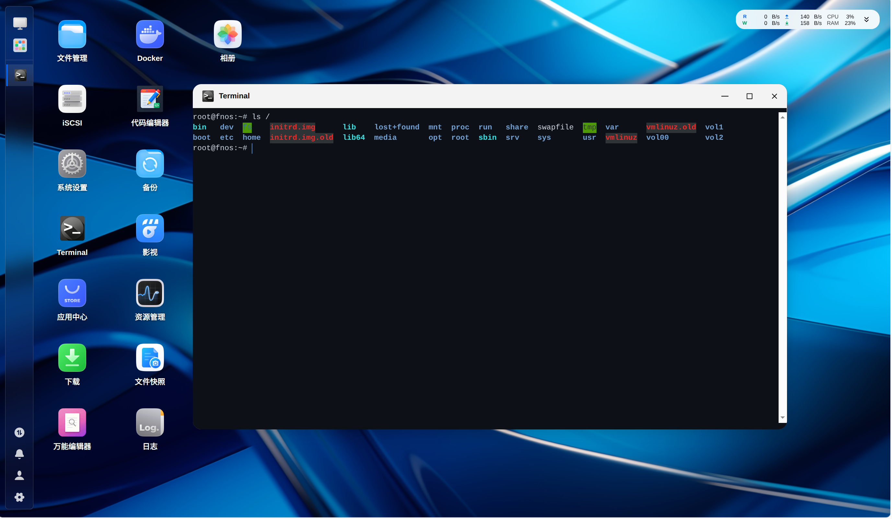
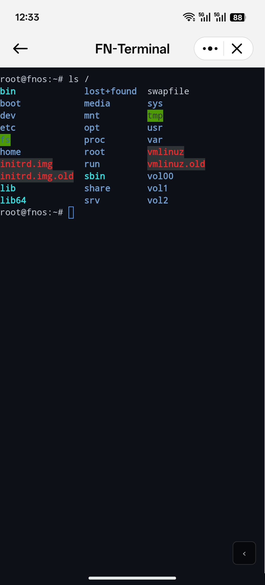

# FN-Terminal

飞牛 fnOS 本地终端管理器 - 通过 Web 浏览器访问 NAS 终端

## 截图

### 桌面端



### 移动端



## 功能特性

- 基于 WebSocket 的实时终端交互
- 支持完整终端功能（颜色、交互命令）
- 移动端自适应，支持触屏字体调节
- 断线重连提示
- WebSocket 心跳保活

## 技术栈

| 组件 | 技术 |
|------|------|
| 后端 | Go + gorilla/websocket + creack/pty |
| 前端 | xterm.js 5.5.0 |
| 通信 | Unix Socket + 统一网关 |
| 打包 | FPK (fnOS Application Package) |

## 系统要求

- fnOS V1.1.3100+（统一网关支持）
- x86_64 架构

## 快捷键

### 桌面端
| 快捷键 | 功能 |
|--------|------|
| `Ctrl+Shift+U` | 增大字体 |
| `Ctrl+Shift+D` | 减小字体 |
| `Ctrl+Shift+R` | 重置字体大小 |

### 移动端
右下角折叠按钮 → 点击箭头 → 点击 Aa → 调节字体大小

## 项目结构

```
fnnas.terminal/
├── app/
│   ├── server/
│   │   ├── terminal-server    # Go 编译二进制
│   │   └── src/
│   │       ├── main.go        # Go 源码
│   │       ├── go.mod
│   │       └── build.sh       # 构建脚本
│   ├── ui/
│   │   ├── config             # 应用入口配置
│   │   ├── images/            # 图标文件
│   │   └── index.cgi
│   └── www/
│       ├── index.html
│       ├── css/style.css
│       └── js/main.js
├── cmd/                       # 生命周期脚本
├── config/                    # 权限配置
├── wizard/                    # 安装向导
├── manifest                   # 应用清单
├── ICON.PNG
├── ICON_256.PNG
├── LICENSE
└── DEVELOPMENT.md             # 开发文档
```

## 构建

### 编译 Go 服务

```bash
cd app/server/src
./build.sh
```

### 打包 FPK

```bash
cd ../..
rm -rf fpk_build && mkdir fpk_build
cp fnnas.terminal/manifest fnnas.terminal/ICON.PNG fnnas.terminal/ICON_256.PNG fnnas.terminal/LICENSE fpk_build/
cp -r fnnas.terminal/cmd fpk_build/
cp -r fnnas.terminal/config fpk_build/
cp -r fnnas.terminal/wizard fpk_build/
cd fnnas.terminal/app
tar -czf ../../fpk_build/app.tgz server ui www
cd ../../fpk_build
tar -czf ../fn-terminal.fpk .
```

## 安装

1. 在 fnOS 应用中心选择"手动安装"
2. 上传 `fn-terminal.fpk`
3. 完成安装后在桌面点击 "Terminal" 图标

## 开发

详见 [DEVELOPMENT.md](DEVELOPMENT.md)

## License

MIT
